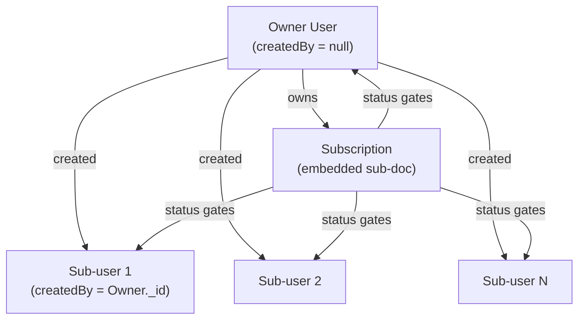

# Subscription & Billing

> Status: **placeholder / design-only**. Stripe is not yet integrated. This document captures the full architecture so the future Stripe wiring is a webhook handler, not a refactor. When you set up Stripe, share this doc back so the implementation matches the contract verbatim.

---

## Goals

1. **Owner pays, everyone uses.** A subscription belongs to the account owner. Sub-users (workers, managers, accountants, etc.) inherit access from the owner — they never have their own subscription.
2. **Strict lapse policy.** When the owner's subscription is anything other than `active` or `trialing`, **every user in that workspace** (owner included) is locked out of the app. No read-only mode. No grace beyond what Stripe itself provides via `past_due` retries.
3. **Sub-users see a generic block.** When a sub-user is locked out, the screen tells them the workspace has no active subscription. No owner name, no email, no mailto — just a clear "you don't have access right now" message and a sign-out button.
4. **Offline uses last-known state.** The mobile app caches the subscription state locally on every successful sync. While offline, the app trusts the cached state. The moment connectivity returns, the next sync tick refreshes it and the gate updates accordingly. No artificial staleness lockout — devices reconnect inevitably and the server is the source of truth at that moment.
5. **Data is never destroyed by lapse.** Locking the workspace blocks logins, not data. The owner re-subscribes and everything resumes instantly.

---

## Conceptual model



One subscription per owner. Every API request resolves the owner once (via `createdBy || _id`) and checks `owner.subscription.status` before any other authorization runs.

---

## Data model

Embed `subscription` directly on the owner `User` document. Sub-users have an empty/ignored subscription field — only the owner's matters.

```js
// backend/models/User.js  (additive — no breaking change)
subscription: {
  status: {
    type: String,
    enum: ['active', 'trialing', 'past_due', 'unpaid', 'canceled', 'incomplete', 'incomplete_expired', 'paused'],
    default: 'active',           // until Stripe lands, every owner is implicitly active
  },
  plan: { type: String, default: null },              // 'starter' | 'pro' | future plan id
  priceIds: { type: [String], default: [] },          // Stripe price ids; future per-module pricing
  currentPeriodEnd: { type: Date, default: null },    // when the paid period ends
  cancelAt: { type: Date, default: null },            // scheduled cancellation
  trialEnd: { type: Date, default: null },
  stripeCustomerId: { type: String, default: null, index: true },
  stripeSubscriptionId: { type: String, default: null, index: true },
  lastWebhookAt: { type: Date, default: null },       // freshness signal
  // Reason captured from Stripe when status flips away from active.
  // Used by the mobile/web "Fix billing" screen to show the user
  // *why* they're blocked (card declined / incomplete payment / etc).
  lastFailureReason: { type: String, default: null },
}
```

Why embedded: the document is 1:1 with the owner, never queried alone, and always needed when the owner is loaded. A separate `Subscription` collection adds a join on every authenticated request for zero benefit.

---

## Allowed-status set

The single source of truth — used by backend, mobile, and web alike — lives in `shared/billing.js`:

```js
// shared/billing.js
export const ALLOWED_STATUSES = new Set(['active', 'trialing']);

export function subscriptionStatus(owner) {
  // 'allow'  - full access
  // 'block'  - lock everyone out, show billing-fix screen
  // No third state. Strict policy.
  if (!owner) return 'block';
  const sub = owner.subscription || {};
  return ALLOWED_STATUSES.has(sub.status) ? 'allow' : 'block';
}

export function billingBlockReason(owner) {
  const sub = owner?.subscription || {};
  if (!sub.status || sub.status === 'canceled') return 'canceled';
  if (sub.status === 'past_due' || sub.status === 'unpaid') return 'paymentFailed';
  if (sub.status === 'incomplete' || sub.status === 'incomplete_expired') return 'incomplete';
  if (sub.status === 'paused') return 'paused';
  return 'unknown';
}
```

**During the placeholder phase, `subscription.status` defaults to `'active'` for every owner, so `subscriptionStatus()` always returns `'allow'` and the gate is a no-op.** When Stripe is wired, the function does not change — only the data does.

---

## Backend enforcement

### Single chokepoint in `protect`

`backend/middleware/auth.js` resolves the owner once per request and blocks if the subscription is not allowed. This cascades to every authenticated route with no per-route changes.

```js
// backend/middleware/auth.js (sketch)
export const protect = async (req, res, next) => {
  // ... existing token + req.user resolution ...

  const ownerId = req.user.createdBy || req.user._id;
  const owner = req.user.createdBy
    ? await User.findById(ownerId).select('subscription firstName lastName email')
    : req.user;

  req.workspaceOwner = owner;

  const billingState = subscriptionStatus(owner);
  if (billingState === 'block') {
    return res.status(402).json({         // 402 Payment Required
      code: 'SUBSCRIPTION_INACTIVE',
      reason: billingBlockReason(owner),
      isOwner: String(req.user._id) === String(ownerId),
    });
  }
  next();
};
```

### Exempt routes (allowlist, not denylist)

Some routes must remain reachable even when the workspace is blocked:

- `POST /api/auth/login`, `POST /api/auth/register`, `POST /api/auth/logout` (no `protect`)
- `GET  /api/auth/me` (so the client can render the lock screen with the owner's name/email)
- `GET  /api/billing/portal-url` (owner only — opens Stripe billing portal)
- `POST /api/billing/checkout` (owner only — start a new subscription)
- `POST /api/billing/webhook` (Stripe → server, no auth)

Implementation: `protect` on these specific routes uses a variant `protectBillingExempt` that skips the subscription check but still verifies the JWT. The owner check on the billing routes uses `requireOwner`.

### Webhook handler (future)

```
POST /api/billing/webhook
  -> verify Stripe signature
  -> on customer.subscription.created/updated/deleted:
       find owner by stripeCustomerId
       update owner.subscription.{ status, currentPeriodEnd, priceIds, lastFailureReason, lastWebhookAt }
       invalidateOwnerCaches(owner._id)   // modules cache + any future caches
  -> on invoice.payment_failed:
       update owner.subscription.lastFailureReason = 'payment_failed'
  -> respond 200
```

---

## Client enforcement (mobile + web)

### `/auth/me` payload — adds `workspace.subscription`

```jsonc
{
  "_id": "...",
  "accountRole": "ground_staff",
  "modules": ["broiler"],
  "workspace": {
    "ownerId": "...",
    "ownerName": "Estera Farms",
    "isOwner": false,
    "subscription": {
      "status": "active",
      "policy": "allow",                 // 'allow' | 'block'
      "reason": null,                    // 'paymentFailed' | 'canceled' | ...
      "currentPeriodEnd": "2026-05-21T00:00:00Z",
      "verifiedAt": "2026-04-21T13:42:11Z"
    }
  }
}
```

### Mobile — offline-first, staleness-checked

The mobile app already runs `deltaSync()` on a periodic interval (`startPeriodicSync()` in `mobile/lib/syncEngine.js`). Extend that loop:

1. On every sync tick, also call `GET /api/auth/me` and persist the `workspace.subscription` block into a dedicated SQLite row (`sync_meta.subscription`).
2. Stamp it with `verifiedAt = now` (informational — used for diagnostics, not for gating).
3. The mobile shell reads this row on every screen render via a `useSubscriptionGate()` hook.

```js
// mobile/hooks/useSubscriptionGate.js (sketch)
export default function useSubscriptionGate() {
  const sub = useLocalSubscription();          // SQLite-backed
  if (!sub) return { policy: 'allow' };        // first launch, no cache yet — trust /auth/me on first sync
  return sub;                                  // 'allow' or 'block' as last seen from server
}
```

There is intentionally no staleness check. A user offline for 30 days with a cached `'allow'` keeps working; the moment they reconnect, the next sync refreshes the state and locks them if the owner has lapsed in the meantime. Devices reconnect inevitably and we'd rather under-block than over-block when the user has zero way to recover.

The root `(app)/_layout.js` wraps its children in a `<SubscriptionGate>` that, when `policy === 'block'`, replaces the app with a full-screen modal — see UX below. **It cannot be dismissed.** The user can:

- (Owner) tap "Fix billing" → opens Stripe customer portal in an in-app browser.
- Tap "Retry" → re-checks `/auth/me` once and unlocks if the workspace is now active.
- Tap "Sign out" → returns to login.

### Web — same gate, simpler delivery

The web app has no offline mode, so it just trusts `/auth/me`. A top-level `<SubscriptionGate>` in the dashboard layout intercepts before any route renders. Same rules: no dismiss, owner sees billing portal CTA, sub-user sees "contact owner" CTA.

### What happens when the gate fires mid-session

Two paths flip the gate to `'block'` at runtime:

1. **Sync tick**: the periodic `deltaSync()` calls `/auth/me`, sees `policy: 'block'`, writes it to `sync_meta.subscription`. The `useSubscriptionGate` hook re-renders and the lock screen replaces the app shell.
2. **Mid-flight 402**: any authenticated request returning `402 SUBSCRIPTION_INACTIVE` triggers the same lock via the axios interceptor (mirrors how `401` currently redirects to `/login`).

In both cases the gate stops the heavy periodic sync loop immediately, but a lightweight 30s `/auth/me` heartbeat keeps running in the background so a fixed billing situation unlocks the app on its own. The user's "Retry" tap is just a faster path to the same check.

### Mutation queue behaviour

The mobile app has an offline mutation queue. When the gate is `'block'`:

- **The full periodic sync loop is stopped** — `stopPeriodicSync()` is called. No entity `deltaSync`, no `processQueue`. Only a lightweight 30s `/auth/me` heartbeat runs.
- **Queued mutations are NOT flushed.** They stay verbatim in `mutation_queue`.
- **No new mutations can be enqueued** — UI buttons are disabled because the gate replaces the app shell entirely; users only see the lock screen.
- **On successful unlock** (heartbeat or manual retry returning `'allow'`), `startPeriodicSync()` is restarted and `processQueue()` runs, flushing everything that was queued before the lock.

A worker who creates daily logs offline, comes back online into a blocked workspace, and waits while the owner pays will see the screen unlock automatically within ~30 seconds and all their offline work submitted correctly. No data loss.

---

## UX: the billing-fix screen

Full-screen, blocking, theme-matched. Two variants:

### Owner variant

```
[ icon: credit card with X ]

Your subscription needs attention

Status: Payment failed

Your most recent payment didn't go through. To keep your team
working, please update your payment method.

[ Fix Billing ]   ← opens Stripe customer portal
[ Retry ]         ← re-checks /auth/me once
[ Sign Out ]
```

### Sub-user variant

```
[ icon: lock ]

No active subscription

This workspace doesn't have an active subscription right now,
so the app is unavailable. Your work is saved and will resume
the moment access is restored.

[ Retry ]         ← re-checks /auth/me once
[ Sign Out ]
```

Deliberately generic — no owner name, no email, no mailto. Workers don't get told who to contact; that's a relationship between them and their employer that lives outside the app.

Both variants:
- Block all navigation.
- Show no app chrome (no tab bar, no sidebar).
- Show no data — protects the perception that "their data is gone."
- Show a "Retry" button for instant manual re-checks.
- Quietly re-poll `GET /api/auth/me` every 30 seconds in the background so the screen unlocks itself shortly after the owner pays — without the user having to tap anything.

While the gate is `'block'`:
- The full `deltaSync()` loop (entity sync + mutation queue flush) is paused. The only network activity is the lightweight 30s `/auth/me` heartbeat.
- The mutation queue is preserved verbatim.
- The moment any `/auth/me` call (background poll, manual retry, or axios interceptor on a 402-then-allow flip) returns `policy: 'allow'`, the periodic sync loop resumes and runs `deltaSync()` + `processQueue()` once to flush anything queued during the lock.

---

## Future Stripe integration checklist

When you're ready to wire Stripe, share this doc back and we execute:

1. **Add env vars**: `STRIPE_SECRET_KEY`, `STRIPE_WEBHOOK_SECRET`, `STRIPE_PRICE_<PLAN>_<MODULE>`, `STRIPE_PORTAL_RETURN_URL`.
2. **Create Stripe products**: one per plan tier; one Price per (plan, billing-period) combination. If we go per-module pricing, one Price per module.
3. **Backend**:
   - `backend/services/billingService.js` — wraps `stripe` SDK calls.
   - `backend/routes/billing.js` — `/portal-url`, `/checkout`, `/webhook`.
   - Wire `billingService.applyWebhook(event)` into the webhook route.
   - On webhook `customer.subscription.updated`, re-derive `User.modules[]` from `priceIds` if we go per-module pricing (Stripe is the source of truth, owner's module list mirrors it).
4. **Registration flow**: after `POST /api/auth/register`, create a Stripe customer, attach `stripeCustomerId` to the new owner, redirect to Stripe Checkout for plan selection. Until checkout completes, `subscription.status = 'incomplete'` → gate fires → user sees "Choose your plan" variant of the billing-fix screen.
5. **Frontend**: build the `<SubscriptionGate>` component once per client (mobile + web), wire to `useSubscriptionGate()` / equivalent web hook. Add the "Fix Billing" button that calls `GET /api/billing/portal-url` and opens the returned URL.
6. **Operations**: configure Stripe webhook endpoint in dashboard, point at `/api/billing/webhook`.

---

## Invariants

These must hold from the placeholder phase onward, so that wiring Stripe later does not require any change to consumers:

1. **`isSubscriptionActive` is the only billing check anywhere.** No route, no client component checks `status === 'active'` directly.
2. **Owner resolution always loads the owner doc** (`req.workspaceOwner`), not just the id, so subscription state is always available without a second query.
3. **`/auth/me` is the single trust source for the client.** Clients never compute the gate from a JWT claim or local heuristic — they read `workspace.subscription.policy`.
4. **Mobile gate trusts last-known cache.** When no cache exists yet (fresh install, pre-first-sync) the gate defaults to `'allow'` so the first `/auth/me` can hydrate it. After that, only the server (via the next sync) changes the policy.
5. **The webhook handler is idempotent.** Stripe re-delivers; multiple applications of the same event must converge on the same state.
6. **The billing screen renders even with no network**, using the last-cached `workspace.subscription` block plus the staleness rule. It must never blank-screen the user just because they're offline.
7. **`User.modules[]` is owned by Stripe** once integrated. Manual edits to it must go through `billingService` so they don't get clobbered by the next webhook.

---

## Open questions to settle when Stripe lands

- **Trial length and conditions.** Card-required trial vs no-card trial?
- **Self-serve cancellation flow** — Stripe customer portal handles it, but do we want a confirmation step in our UI before linking out?
- **Per-module pricing or single tier?** If per-module, the module switcher in the mobile app needs to gracefully handle "you used to have egg-production but the price was removed from your subscription."
- **Multi-seat pricing.** Do we charge per sub-user? If so, the invite flow needs a "this will increase your bill by X" confirmation.
- **Refunds / proration on plan downgrade.** Stripe handles the math; UX wording is the open question.
- **Dunning emails.** Stripe Smart Retries vs custom email cadence?
- **Tax / VAT.** UAE/GCC VAT must be collected — Stripe Tax or manual?
